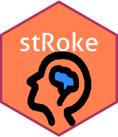

<!-- badges: start -->
[](https://github.com/agdamsbo/stRoke)
[](https://CRAN.R-project.org/package=stRoke)
[](https://doi.org/10.5281/zenodo.7572023)
[](https://github.com/agdamsbo/stRoke/actions/workflows/R-CMD-check.yaml)
[](https://github.com/agdamsbo/stRoke/actions/workflows/pages/pages-build-deployment)
[](https://app.codecov.io/gh/agdamsbo/stRoke?branch=main)
[](https://cran.r-project.org/package=stRoke)
<!-- badges: end -->

# stRoke package 

This is an R-toolbox of custom functions for convenient data management and analysis in clinical health research and teaching.
The package is mainly collected for personal use, but any use beyond that is encouraged.
This package has migrated functions from the agdamsbo/daDoctoR-package, and new functions has been added.

## Contribute

This package is [shared on GitHub](https://github.com/agdamsbo/stRoke), and you are very welcome to contribute by opening an issue or a pull request.

# Installation

The package can be installed directly from CRAN:

```
install.packages("stRoke")
```

The latest version in development can be installed from GitHub:

```
remotes::install_github("agdamsbo/stRoke")
```
